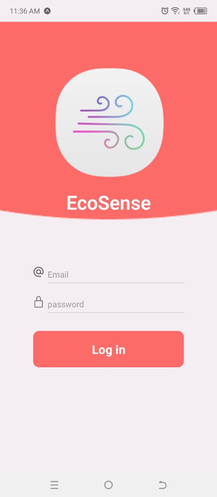
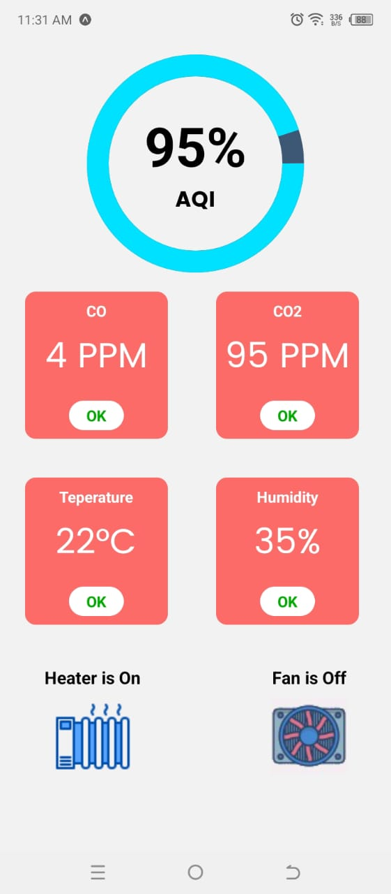
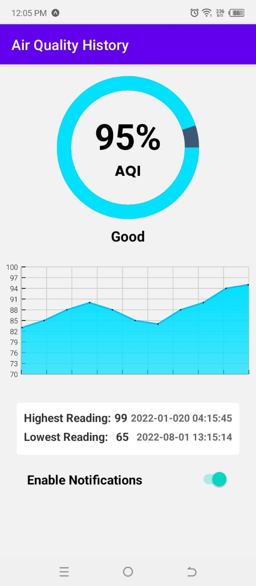
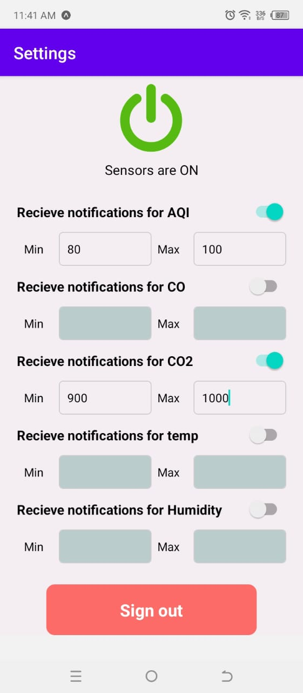
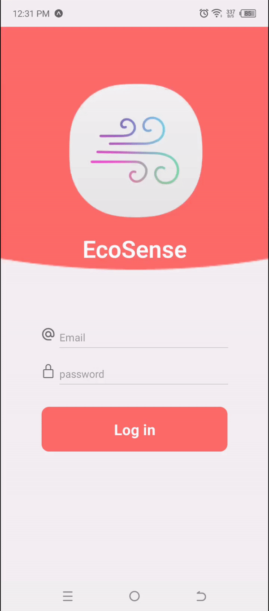
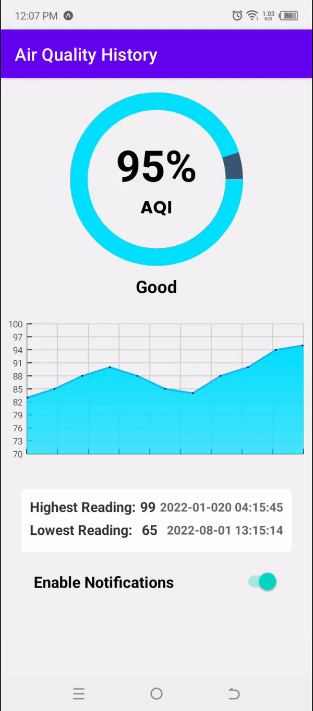
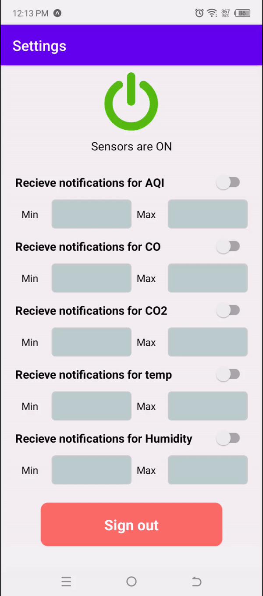

<br><br>

<!-- project philosophy -->


> EcoSense is a mobile app for real-time monitoring of indoor air quality, providing users with essential information about their environment. With EcoSense, users can easily track air vitals such as air quality, carbon monoxide, carbon dioxide, temperature, and humidity. By providing up-to-date information, EcoSense empowers users to make informed decisions about their health and the environment around them.

### User Stories
- As a user, I want to be able to log into the app with my credentials, so that I can access my indoor air quality data and settings
- As a user, I want to be able to check the real-time readings of air quality, Carbon Monoxide, Carbon Dioxide, temperature, and humidity in my room, so that I can monitor the indoor air quality
- As a user, I want to receive real-time updates/notifications on air quality, Carbon Monoxide, Carbon Dioxide, temperature, and humidity levels in my room, so that I can take necessary actions if needed.
- As a user, I want to be able to view historical data on the air quality in my room, so that I can track changes over time and make informed decisions.
- As a user, I want to be able to set up alerts for specific thresholds for air quality, Carbon Monoxide, Carbon Dioxide, temperature, and humidity, so that I can take action before the air quality gets too bad.
- As a user, I want to be able to turn the indoor air quality monitor on or off remotely from my phone, so that I can easily manage its operation.

<br><br>

<!-- Prototyping -->


> We designed EcoSense using wireframes and mockups, iterating on the design until we reached the ideal layout for easy navigation and a seamless user experience.


### Mockups
| Login screen  | Home Screen | AQIHistory Screen| Settings Screen |
| ---| ---| ---| ---|
|  | |  |  |

<br><br>

<!-- Implementation -->


> Using the wireframes and mockups as a guide, we implemented the EcoSense app with the following features:

### User Screens (Mobile)
| Login screen  | AQIHistory screen | Settings screen |
| ---| ---| ---|
|  |  |  |


<br><br>

<!-- Tech stack -->


###  EcoSense is built using the following technologies:

- This project was built using [React Native](https://reactnative.dev/) and [Expo](https://docs.expo.dev/) Cross-Platform Mobile Development tools. Expo is a framework to build React Native apps. It is a set with tools and services built for React Native.
- The backend of the app uses [Express](https://expressjs.com/), the [Node.js](https://nodejs.org/) web application framework. Express is a minimal and flexible Node.js web application framework that provides a robust set of features for web and mobile applications.
- For storage (database), the app uses [MongoDB ](https://www.mongodb.com/), a flexible and scalable noSQL timeseries database that stores data in JSON-like documents.
- For hardware programming, the ESP8266 microcontroller[ESP8266](https://arduino.esp8266.com/) and Arduino IDE [ESP8266](https://www.arduino.cc/) were used to develop and collect sensor data. The ESP8266 connected to Wi-Fi and sent the data to the database for storage, allowing for real-time monitoring of indoor air quality through our EcoSense mobile app.
<br><br>

<!-- How to run -->


> To set up EcoSense locally, follow these steps:

### Prerequisites

- Download and install [Node.js](https://nodejs.org/en/)

- Download and install [MongoDB](https://www.mongodb.com/docs/manual/installation/)

- npm
  ```sh
  npm install npm@latest -g
  ```
- Expo CLI
  ```sh
  npm install --global expo-cli
  ```
- Download the [Expo Go](https://expo.dev/client) mobile app from the app store

### Installation

1. Clone the repo
   ```sh
   git clone https://github.com/Fadi-Haddad-235/EcoSense.git
   ```
2. Navigate to the frontend folder and install dependencies
   ```sh
   cd EcoSense-mobile/EcoSense
   npm install
   ```
3. Navigate to the ".env" file in the EcoSense-server folder and change the PORT Number and MONGODB_URI and JWT_SECRET.
4. Navigate to the "secrets.h" file in the EcoSense-server/Arduino folder and change the [ssid,password] to match your wifi credentials.

5. Run the start up command
   ```sh
   npm run web
   ```
6. Scan the generated QR code with your camera (ios) or through the Expo Go application (android).

Now, you should be able to run EcoSense locally and explore its features.
